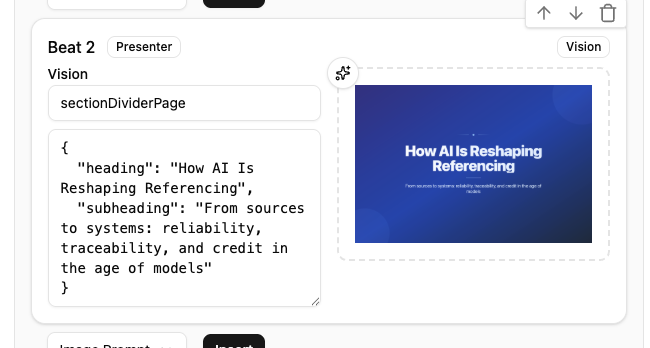

# MulmoCast App 使用方法ガイド

MulmoCast AppはAIを活用したマルチメディアプレゼンテーション作成アプリケーションです。このガイドでは、アプリケーションのダウンロードから基本的な使用方法まで詳しく解説します。

## アプリケーション ダウンロード方法

### Mac版のダウンロード

Mac版のアプリケーションは以下のGitHub Actionsページからダウンロードできます：
https://github.com/receptron/mulmocast-app/actions/workflows/ci-mac.yml

**手順：**
1. 上記のリンクにアクセスし、「Build, Notarize, and Release for macOS」のワークフローページを開きます
   

2. 最新の成功したワークフロー（緑色のチェックマーク付き）をクリックします

3. 画面下部の「Artifacts」セクションで「macOS-release-files」をクリックしてダウンロードします
   

4. ダウンロード完了後、ZIPファイルを解凍します。解凍されたファイルの中に `MulmoCast.app` があります

5. `MulmoCast.app` をアプリケーションフォルダにドラッグ&ドロップしてインストールします
   

### (参考) Windows版のダウンロードリンク

Windows版は以下のリンクから同様の手順でダウンロードできます：
https://github.com/receptron/mulmocast-app/actions/workflows/ci-ms.yml

## 使い方

### 初期設定

アプリケーションを初回起動したら、以下の設定を行います：

#### 1. 表示言語の設定
- 日本語または英語から選択できます
- アプリケーションの表示言語を変更します

#### 2. API キーの設定
AI機能を使用するために、各種サービスのAPI キーを設定します。
各API の詳細な用途はラベルに表示されます。必要な機能に応じて設定してください。

#### 3. 言語設定
- **スクリプト言語**: 生成するコンテンツの言語
- **翻訳先言語**: 多言語対応時の翻訳先言語

#### 4. LLM（大規模言語モデル）設定
AI チャット機能で使用するLLM を選択します：
OpenAI / Ollama などが使えます。

**重要**: 選択したLLM に対応するAPI キーの設定が必要です。

### ダッシュボード

アプリケーションのメイン画面です。ここからプロジェクトの管理を行います。

### 新規プロジェクトの作成
ダッシュボード画面の「新規作成」ボタンをクリックすると、新規プロジェクトを作成できます。

### プロジェクト編集画面
プロジェクト編集画面は大きく分けて、4つに分かれています。

- AI チャット
- スクリプト編集
- 出力設定 & 生成
- 成果物

### 基本的な流れ
- AI チャットと相談してスクリプトを作る
- 作ったスクリプトをもとに微調整する
- 出力形式（動画、音声、PDF）決めて生成する
- 生成物を確認する

#### AI チャット
- 設定したLLM とチャットしながらコンテンツを作成
- URL 入れて読み込ませることも可能
- スクリプトを作成するには、テンプレートを選んで「入力欄にコピー」し、内容を修正して送信ボタンを押してください。

#### スクリプト編集
- Text
  - 音声生成のベースとなる文章の編集
  - 音声への変換
  - 翻訳
- YAML/JSON
  - スクリプトを YAML/JSON で編集します
- Media  
  2種類作れる
  - 画像/動画（Prompt で生成、ドラッグ&ドロップ、URL から取得）
  - スライド（Markdown / CHart / Mermaid など）

    注: Vision は開発中です。JSON ファイルに必要な情報はこちらを参考にしてください。https://github.com/receptron/mulmocast-vision/tree/main/html/html

    html/html/sectionDividerPage.html を例にすると、以下のように指定すると予め用意されたテンプレートに則って生成されます。

    

- Style
    生成に必要なスタイル設定を行います
    - Canvas Size
    - Speech Parameters
    - Image Parameters
    - Movie Parameters
    - Text Slide Parameters
    - Audio Parameters
    - Caption Parameters

#### 出力設定 & 生成
何を生成するか指定します
- Movie
- Podcast
- PDF

#### 成果物
- 動画
- PDF
- Podcast
- スライド → 右上のボタンで拡大して視聴可能です
