# MulmoCast 使用方法ガイド その2
この資料では具体的な使い方を説明します。基本的な使い方等は [MulmoCast App 使用方法ガイド](./how_to_use.md) を参照してください。

## 準備するもの
- macOS が動作するパソコン（Windows、Linux での動作は未確認のため）
- OpenAI API Key
  - OpenAI 開発者アカウントから取得できます
  - https://platform.openai.com/settings/organization/api-keys
- **gpt-image-1** モデルを使いたい場合
  - OpenAI の認証が済んでいるアカウント
    - OpenAI > Organization settings > Verifications にて認証
    - URL: https://platform.openai.com/settings/organization/general

## 初期設定
- [アプリケーション使い方](./how_to_use.md#アプリケーション-使い方) にて初期設定を行います。
  - Display Language: 日本語
  - LLM設定
    - LLM設定: OpenAI
    - モデル: gpt-5
  - API key
    - OpenAI であることを確認して、OpenAI API Key を入力してください
- 上記でオンボーディング完了ですが、もう一つ設定を追加します。
- 右上の「設定」ボタンを押し、スクリプトの主言語を日本語に設定してください。設定内容は自動で保存されます。
  - 言語設定
    - スクリプトの主言語: 日本語

    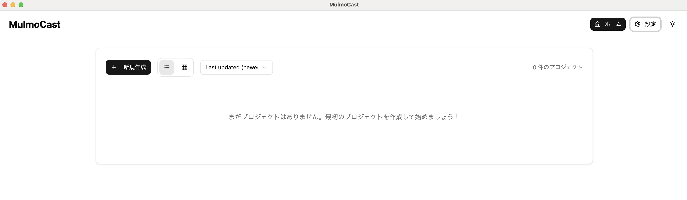

- ここまで完了すると以下の設定になっています。
  - 表示言語: 日本語
  - APIキー設定: OpenAI API Key 設定済み
  - 言語設定
    - スクリプトの主言語: 日本語
    - 翻訳先の言語: 英語、日本語
  - LLM設定
    - LLM設定: OpenAI
    - モデル: gpt-5


## プロジェクト作成
- 「新規作成」ボタンを押すと、プロジェクトページに遷移します。

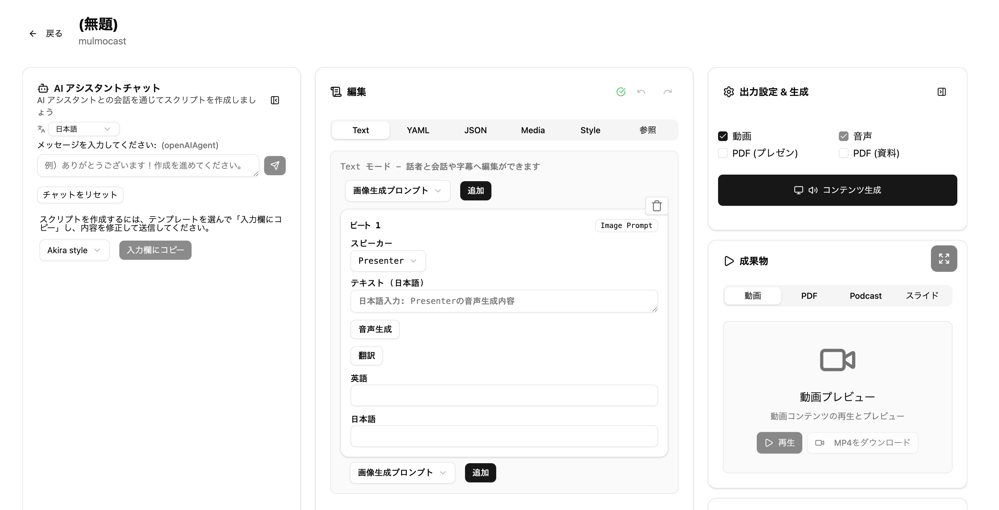

## スクリプト作成
ここでは、Apple の新製品発表の内容をジブリ風画像で作ってみます。

### AI アシスタントチャット
1. AI アシスタントチャットに  
    ```
    https://www.apple.com/jp/apple-events/ を読み込んで
    ```
    と入れて、送信ボタンを押します。

    

2. 先ほど設定したLLM (今回は OpenAI GPT-5) を活用して、ユーザーからの依頼に応えます。必要に応じて、Web検索、Web閲覧等も行います。(Web 検索には EXA API が必要です)

    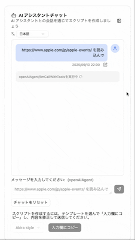
    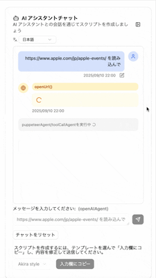
    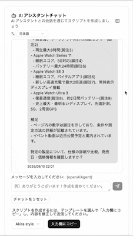

3. テンプレート選択して、「入力欄へコピー」を押します。
    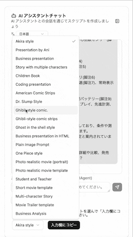
    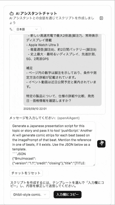

4. 入力欄にスクリプト生成用のプロンプトが反映されます。確認後送信ボタンを押します。なお、テンプレートの `Generate a Japanese presentation script for this topic or story and pass it to tool 'pushScript.'` を Generate a Japanese presentation script **in 5 beats** for this topic or story and pass it to tool 'pushScript.' のようにプロンプトを変更して送信もできます。

5. スクリプト生成が終わると、プロジェクトのタイトル、編集エリアに反映されます。
    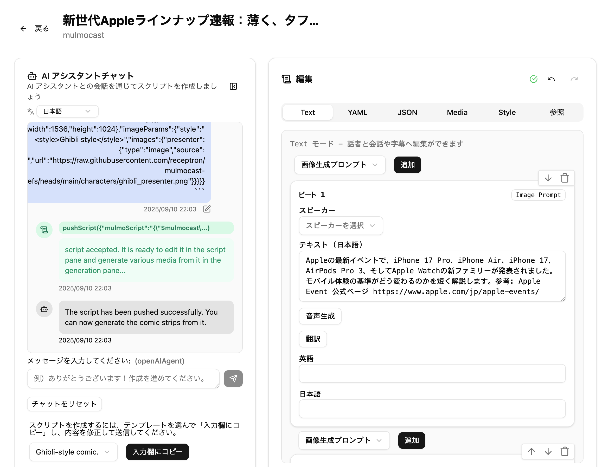

### 編集エリア
OpenAI の **Verifications** が完了していない方は以下の通り変更します。  
`dall-e-3` は画像生成能力が低いため、ジブリ風の画像出力はできません。ジブリ風を楽しみたい方はOpenAI の **Verifications** を済ませてください。

1. Style タブを選択します
2. 画像設定のモデルを `dall-e-3` に変更します。 

    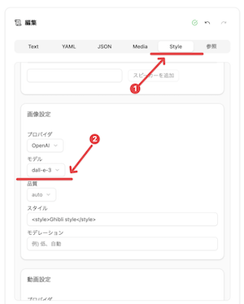

### 出力設定 & 生成
1. 全てにチェックを入れて、「コンテンツ生成」ボタンを押します

    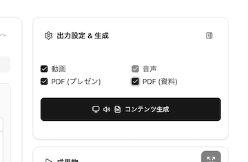

2. 音声生成、動画生成等が始まります。右下に生成状況が表示されます。

    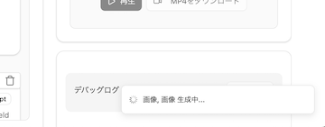

3. 生成完了すると、成果物エリアに表示されます。

    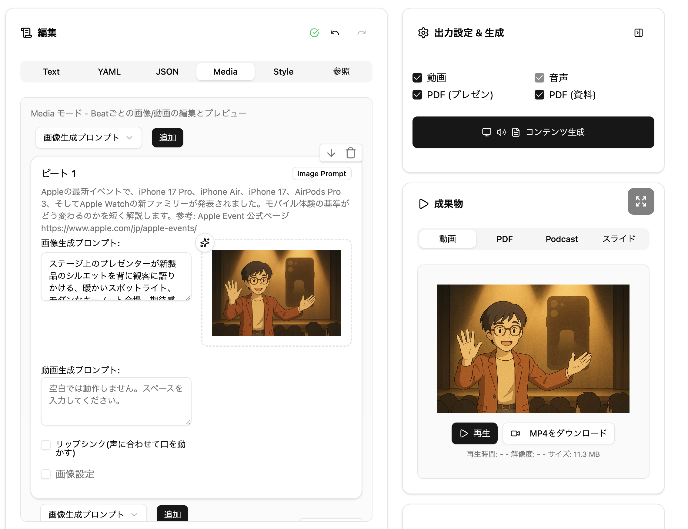

### 成果物
- 各形式（動画、PDF、音声）をダウンロードできます
- 右上の拡大ボタンを押すと Mulmo Viewer が開きます

### Mulmo Viewer
様々な形態（マルチモーダル）でコンテンツを視聴できます。
- ビートごとに以下の3つの情報が表示されます
  - 画像/動画（この資料のコンテンツだと画像のみ）
  - 音声
  - テキスト
- 視聴開始には再生ボタン（画像/動画にポインターを合わせると再生ボタンが表示されます）を押してください
- 視聴中でもページ送りは可能です
    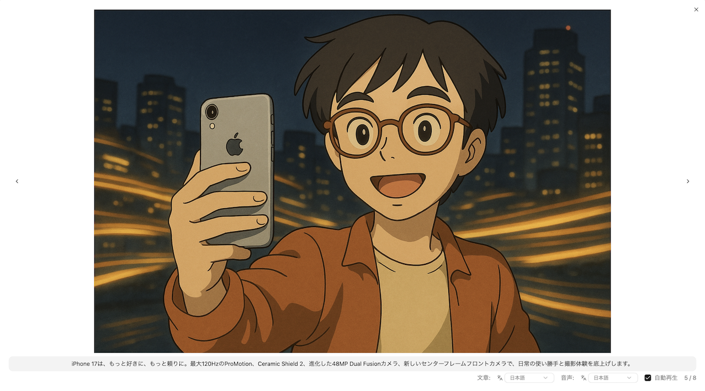

- テキストを英語で読みたい時
  -  `文章` を `英語` に変更してください
  -  「翻訳する」ボタンを押してください

    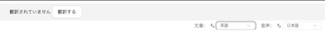

- 音声を英語で聞きたい時
  -  `音声` を `英語` に変更してください
  -  「音声生成」ボタンを押してください

    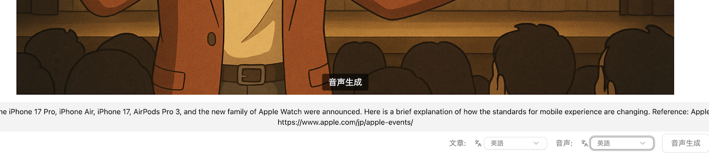
